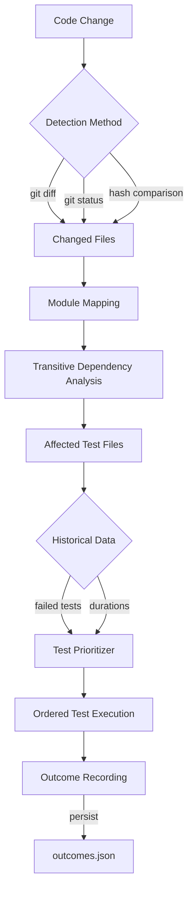

# Py Smart Test

[](https://opensource.org/licenses/MIT)
[](https://www.python.org/downloads/)
[](#testing)
[](#testing)

**Smart Test Runner and Pytest Plugin** for Python projects. Runs only the tests affected by your code changes, with intelligent prioritization, outcome tracking, and robust fallbacks.

## 🚀 Features

- **Pytest Plugin** — zero-config integration via `--smart`, `--smart-first`, and `--smart-working-tree` flags
- **Smart Test Execution** — runs only tests relevant to changed code (Git diff, staged, working-tree, or hash-based detection)
- **Test Prioritization** — previously failed tests run first, then affected, then by historical duration
- **Outcome Tracking** — persists pass/fail/skip results and durations across sessions for smarter ordering
- **Dependency Graph Analysis** — AST-based import analysis builds comprehensive transitive dependency maps
- **Multiple Change Detection Methods**:
  - Git diff: compare against branches/tags (default: `main`)
  - Staged changes: test only staged modifications
  - Working-tree: detect unstaged/untracked files via `git status`
  - Hash-based fallback: works without Git repository
- **Robust Fallbacks** — auto-falls back through git → hash → full suite → error with logging
- **Auto-Regeneration** — detects stale dependency graphs and regenerates automatically
- **JSON Output** — `--json` flag on CLI for CI/CD integration and scripting
- **Structured Logging** — all operations logged to files with configurable verbosity

## 📋 Table of Contents

- [Installation](#-installation)
- [Quick Start](#-quick-start)
- [Pytest Plugin](#-pytest-plugin)
- [CLI Usage](#-cli-usage)
- [Architecture](#-architecture)
- [Configuration](#-configuration)
- [Testing](#-testing)
- [Development](#-development)
- [License](#-license)

## 🛠️ Installation

### Requirements

- Python 3.11+
- Git (optional, for Git-based change detection)

### Install from PyPI

```bash
pip install py-smart-test
```

### Install from Source

```bash
git clone <repository-url>
cd py-smart-test

# Install with uv (recommended)
uv pip install -e .

# Or with pip
pip install -e .
```

## 🚀 Quick Start

### As a Pytest Plugin (recommended)

```bash
# Run only affected tests
pytest --smart

# Run affected tests first, then everything else
pytest --smart-first

# Detect changes from unstaged/untracked files
pytest --smart-working-tree

# Combine: working-tree detection + affected-only
pytest --smart --smart-working-tree
```

### As a CLI Tool

```bash
# Run affected tests (compares current branch vs main)
py-smart-test

# Output affected tests as JSON (no test execution)
py-smart-test --json

# Run affected tests for staged changes only
py-smart-test --staged

# Dry run to see what would be tested
py-smart-test --dry-run

# Run all tests (bypass smart detection)
py-smart-test --mode all

# Force graph regeneration
py-smart-test --regenerate-graph
```

## 🔌 Pytest Plugin

The pytest plugin integrates directly into your test workflow — no configuration files needed. Install `py-smart-test` and the plugin is auto-discovered.

### Plugin Options

| Flag                   | Description                                                                       |
| ---------------------- | --------------------------------------------------------------------------------- |
| `--smart`              | Run **only** tests affected by code changes. Deselects unaffected tests entirely. |
| `--smart-first`        | Run **all** tests, but prioritize affected tests first.                           |
| `--smart-no-collect`   | Alias for `--smart`.                                                              |
| `--smart-since REF`    | Git reference to diff against (default: `main`).                                  |
| `--smart-staged`       | Diff staged changes only (like `git diff --cached`).                              |
| `--smart-working-tree` | Detect changes via `git status` — ideal for active development.                   |

### How It Works

1. **Collection phase** — the plugin hooks into `pytest_collection_modifyitems` to filter/reorder tests
2. **Change detection** — identifies modified files via git diff or working-tree status
3. **Dependency analysis** — traverses the import graph to find all transitively affected modules
4. **Test prioritization** — orders tests: previously-failed → affected → shortest-duration-first
5. **Outcome recording** — `pytest_runtest_makereport` records pass/fail/skip + duration for each test
6. **Session finish** — `pytest_sessionfinish` persists outcomes to `.py_smart_test/outcomes.json`

### Examples

```bash
# During active development (unstaged changes)
pytest --smart --smart-working-tree

# In CI against a feature branch
pytest --smart --smart-since origin/main

# Test everything but put likely-failures first
pytest --smart-first

# Only staged changes (pre-commit hook style)
pytest --smart --smart-staged
```

## 💻 CLI Usage

### Command Aliases

| Full Command              | Alias          | Purpose                   |
| ------------------------- | -------------- | ------------------------- |
| `py-smart-test`           | `pst`          | Smart test runner         |
| `py-smart-test-graph-gen` | `pst-gen`      | Generate dependency graph |
| `py-smart-test-map-tests` | `pst-map`      | Test module mapping       |
| `py-smart-test-affected`  | `pst-affected` | Find affected modules     |
| `py-smart-test-stale`     | `pst-stale`    | Check graph staleness     |

### `py-smart-test` — Smart Test Runner

The primary command for running tests intelligently.

```bash
py-smart-test [OPTIONS]
```

**Options:**

| Option                               | Default         | Description                            |
| ------------------------------------ | --------------- | -------------------------------------- |
| `--mode [affected\|all]`             | `affected`      | Test mode                              |
| `--since REF`                        | `main`          | Git base reference                     |
| `--staged` / `--no-staged`           | `--no-staged`   | Use only staged changes                |
| `--regenerate-graph`                 | `false`         | Force dependency graph regeneration    |
| `--exclude-e2e` / `--no-exclude-e2e` | `--exclude-e2e` | Exclude E2E tests                      |
| `--dry-run`                          | `false`         | Show what would run without executing  |
| `--json`                             | `false`         | Output affected tests as JSON and exit |

### `pst-affected` — Find Affected Modules

Debug or script affected module detection.

```bash
pst-affected [OPTIONS]

Options:
  --base REF      Git base reference (default: main)
  --staged        Check staged changes only
  --json          Output in JSON format
```

### `pst-gen` — Generate Dependency Graph

Manually generate or update the dependency graph.

```bash
pst-gen
```

### `pst-stale` — Check Graph Staleness

Check if the dependency graph needs regeneration.

```bash
pst-stale
```

## 📂 Architecture

### Core Components

```text
src/py_smart_test/
├── smart_test_runner.py          # Main CLI orchestrator (Typer app)
├── pytest_plugin.py              # Pytest plugin hooks (collection, reporting, session)
├── find_affected_modules.py      # Change detection + dependency traversal
├── generate_dependency_graph.py  # AST-based import analysis
├── test_outcome_store.py         # Persist pass/fail/duration history
├── test_prioritizer.py           # Test ordering (failed-first, affected, duration)
├── test_module_mapper.py         # Test-to-module heuristics
├── detect_graph_staleness.py     # Graph freshness detection
├── file_hash_manager.py          # Hash-based change detection
├── _paths.py                     # Path configuration and constants
└── __init__.py                   # Package initialization
```

### Data Flow



### Storage Structure

```text
.py_smart_test/
├── dependency_graph.json     # Import dependency graph
├── file_hashes.json          # File hash snapshots
├── outcomes.json             # Test pass/fail/duration history
├── logs/
│   └── latest_run.log        # Execution logs
└── cache/                    # Reserved for future use
```

### Fallback Strategy

```text
1. Git diff change detection
   └─ fallback → Hash-based change detection
      └─ fallback → Full test suite
         └─ fallback → Graceful error with logging
```

## ⚙️ Configuration

### Environment Variables

| Variable                  | Description                                     |
| ------------------------- | ----------------------------------------------- |
| `PY_SMART_TEST_LOG_LEVEL` | Set logging level (DEBUG, INFO, WARNING, ERROR) |
| `PY_SMART_TEST_CACHE_DIR` | Override cache directory location               |

### Path Configuration

The system automatically detects project structure:

| Path            | Purpose                   |
| --------------- | ------------------------- |
| Repository root | Current working directory |
| Source code     | `src/<package>/`          |
| Tests           | `tests/`                  |
| Cache           | `.py_smart_test/`         |

## 🧪 Testing

### Running Tests

```bash
# Run all tests
uv run pytest

# Run with coverage
uv run coverage run -m pytest tests/ -p no:cov
uv run coverage report --show-missing

# Run specific test file
uv run pytest tests/test_pytest_plugin.py -v
```

### Test Suite

- **109 tests** covering all modules
- **96% overall coverage** (713 statements, 29 missed)
- Core modules at **100%**: `pytest_plugin.py`, `test_outcome_store.py`, `test_prioritizer.py`

| Test File                           | Tests | What's Covered                                       |
| ----------------------------------- | ----- | ---------------------------------------------------- |
| `test_pytest_plugin.py`             | 21    | Plugin hooks, option registration, smart/first modes |
| `test_find_affected_modules.py`     | 15    | Change detection, dependency traversal, working-tree |
| `test_smart_test_runner.py`         | 12    | CLI orchestration, pytest invocation, error handling |
| `test_outcome_store.py`             | 12    | Outcome persistence, error handling, corrupt data    |
| `test_detect_graph_staleness.py`    | 11    | Graph freshness, hash comparison                     |
| `test_file_hash_manager.py`         | 9     | Hash computation, snapshot management                |
| `test_generate_dependency_graph.py` | 8     | AST parsing, import resolution                       |
| `test_test_module_mapper.py`        | 8     | Module-to-test mapping heuristics                    |
| `test_prioritizer.py`               | 7     | Test ordering logic                                  |
| `test_bug_fixes.py`                 | 5     | Regression tests for fixed bugs                      |
| `test_init.py`                      | 1     | Package initialization                               |

## 🏗️ Development

### Setup

```bash
# Install development dependencies
uv add --dev -e .

# Install pre-commit hooks
uv run pre-commit install --install-hooks
uv run pre-commit install --hook-type commit-msg
```

### Code Quality

```bash
# Lint
uv run ruff check src/ tests/

# Format
uv run ruff format src/ tests/

# Type check
uv run pyright src/
```

### E2E Verification

An end-to-end verification script is included that creates a temporary project, installs `py-smart-test` from local source, and tests all features:

```bash
bash scripts/verify_e2e.sh
```

### Conventional Commits

This project uses [Conventional Commits](https://conventionalcommits.org/). Pre-commit hooks validate commit messages.

```
<type>[scope]: <description>
```

**Types:** `feat`, `fix`, `docs`, `style`, `refactor`, `perf`, `test`, `build`, `ci`, `chore`, `revert`

### Version Management

```bash
# Bump version and generate changelog
uv run cz bump

# Preview
uv run cz bump --dry-run
```

## 🤝 Contributing

We welcome contributions! Please see our [Contributing Guidelines](CONTRIBUTING.md) for details.

## 📄 License

This project is licensed under the MIT License — see the [LICENSE](LICENSE) file for details.

## 🙏 Acknowledgments

- Built with [Typer](https://typer.tiangolo.com/) for CLI
- Uses [Pydantic](https://pydantic-docs.helpmanual.io/) for data validation
- Pytest plugin architecture inspired by [pytest-picked](https://github.com/anapaulagomes/pytest-picked)
